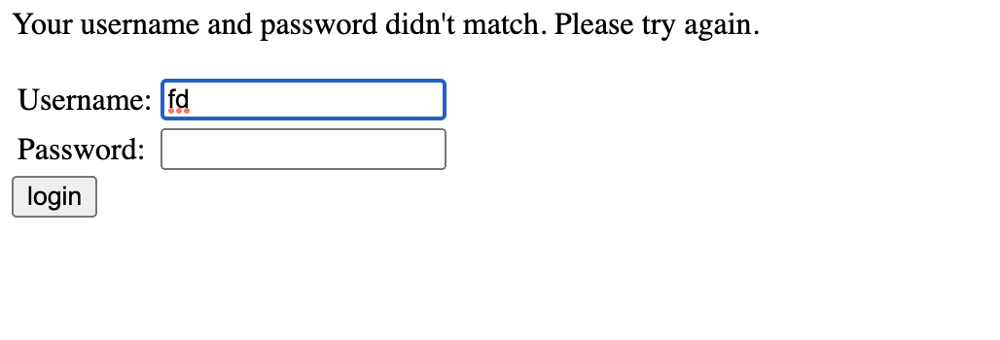
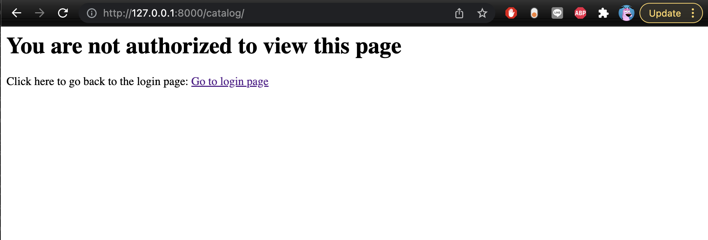
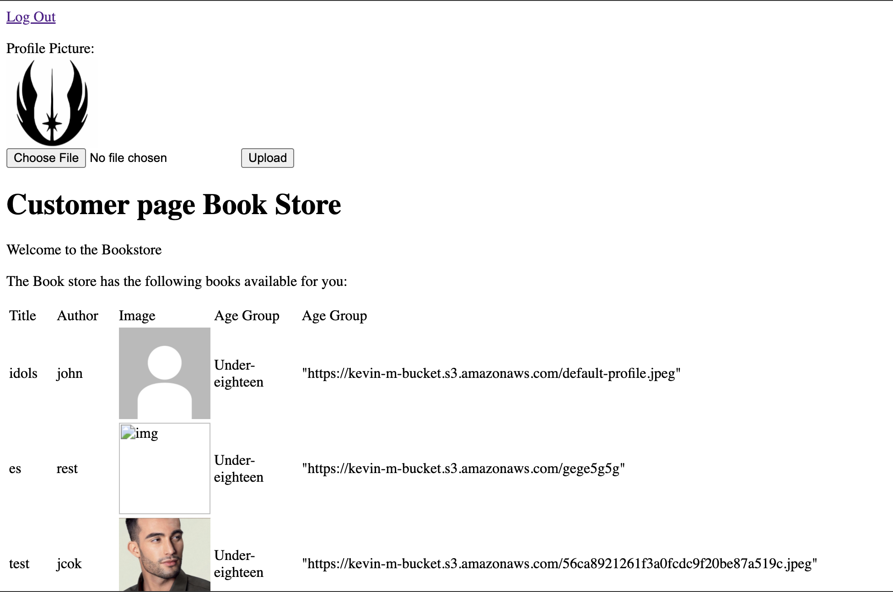
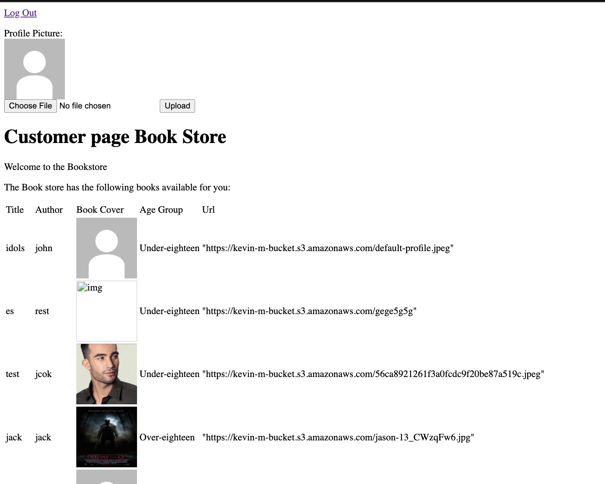
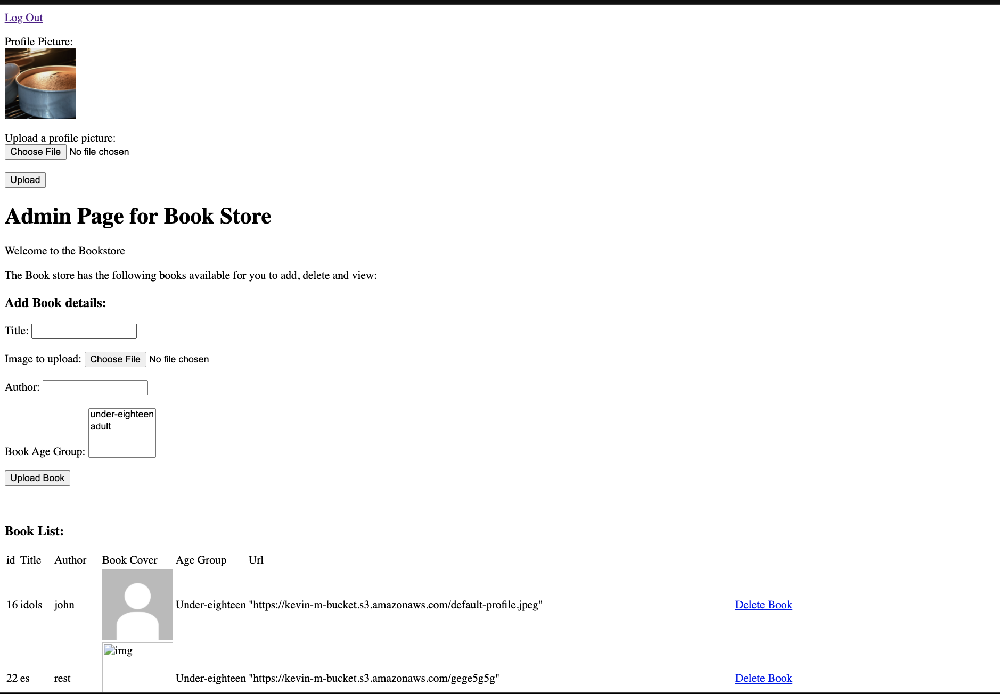
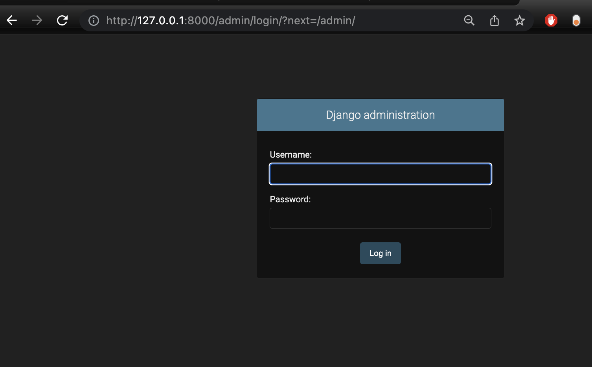
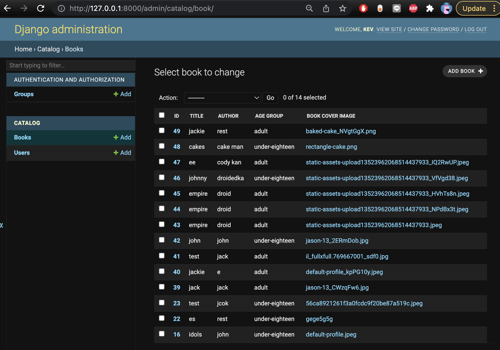

# Django Bookstore Backend System

## How to run

Go to the terminal of the root directory of local library and run these commands

```
python3 manage.py makemigrations
python3 manage.py migrate
python3 manage.py runserver
```

Go to the log in page by going through this link http://127.0.0.1:8000/catalog/login/ 
You will be directed to this page


The website will accept three user types, admin,kid  customer and adult customer. I have added 3 users that correspond to each user type: 

| Username         | Password            | Position      |
| ---------------- | ------------------- | ------------- |
| Gale             | duckknight1         | adult customer|
| kev              | duckknight1         | kid customer  |
| master           | duckknight1         | admin         |

Logging in with a username or password thats incorrect will create an eror message:



Additionally, trying to access the home page (http://127.0.0.1:8000/catalog/)for the customers and admin without authenticating in will direct you to an error page:




## Kid customer page

Accessing the website as a kid customer will direct you to this page:



The web page will show the user a list of books that are under eighteen as shown in the age group column. Details of the books such as its
authors, title, book cover image and url are shown  in the list. The profile and book cover images are retrieved from the aws s3 server and correspond to each 
user and book through the user id and book id in the html files and the django database. To upload and change the profile image of the user, click choose file
to select the image and click upload to upload the image. As shown, only books that are under eighteen are shown to kid customers.

## adult customer page

Accessing the website as an adult customer will direct you to this page:



It will have the same details like the kid customer page with the added benefit of also having books that are over eighteen and adult.

## admin  page
Accessing the website as an admin will direct you to this page:



The admin can view, delete and add books. to delete a book, click the delete button that corresponds to the book you want to delete. To add
a book, fill in all the the details provided in the form: title, image to upload, author and book age group, then click "upload book" to upload the book
into the database.

## django admin page

To go to the django admin page to add, edit, view and delete books and users, go to  http://127.0.0.1:8000/admin/ and enter the user details:
username:kev, password:duckknight1 to login the page.



Logging in the page will direct you here


