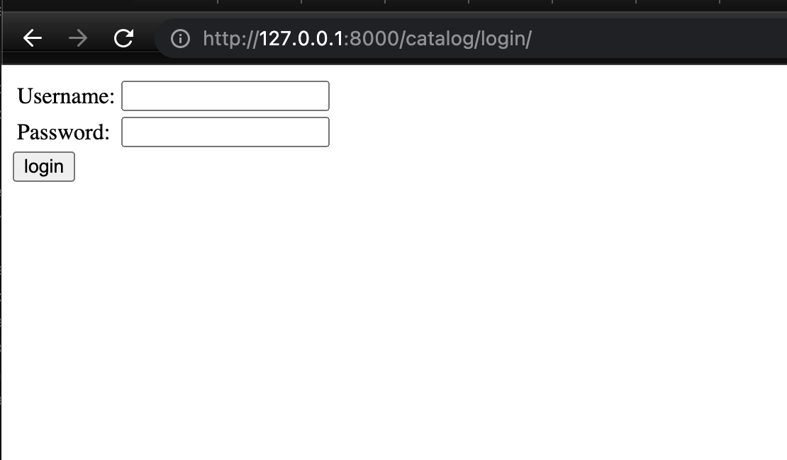

# Django Bookstore Backend System

## How to run

Go to the terminal of the root directory of local library and run these commands

```
python3 manage.py makemigrations
python3 manage.py migrate
python3 manage.py runserver
```

Go to the log in page by going through this link http://127.0.0.1:8000/catalog/login/
You will be directed to this page


